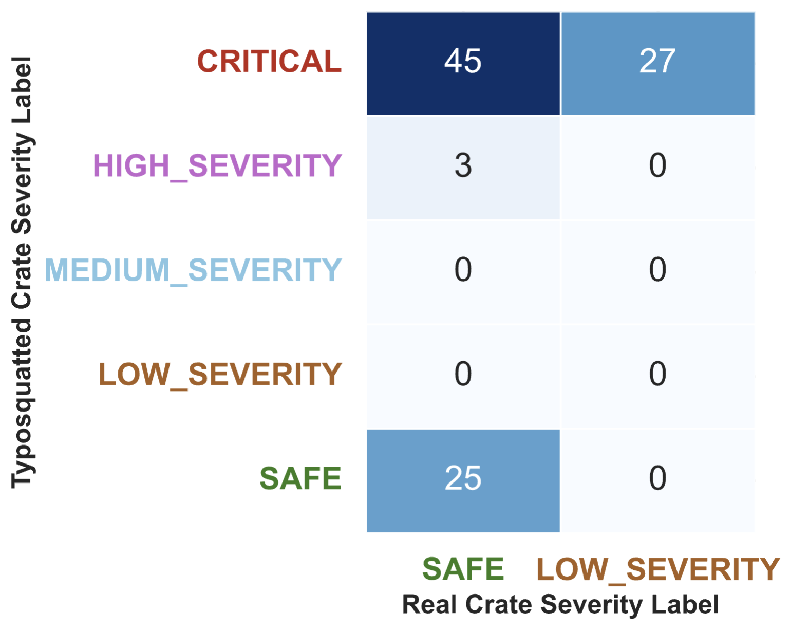
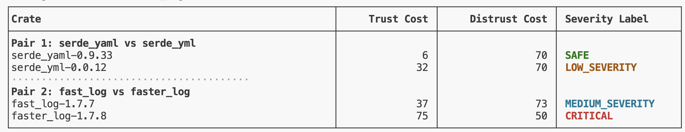
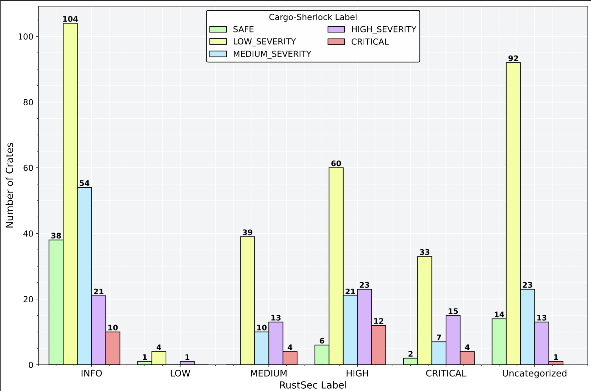
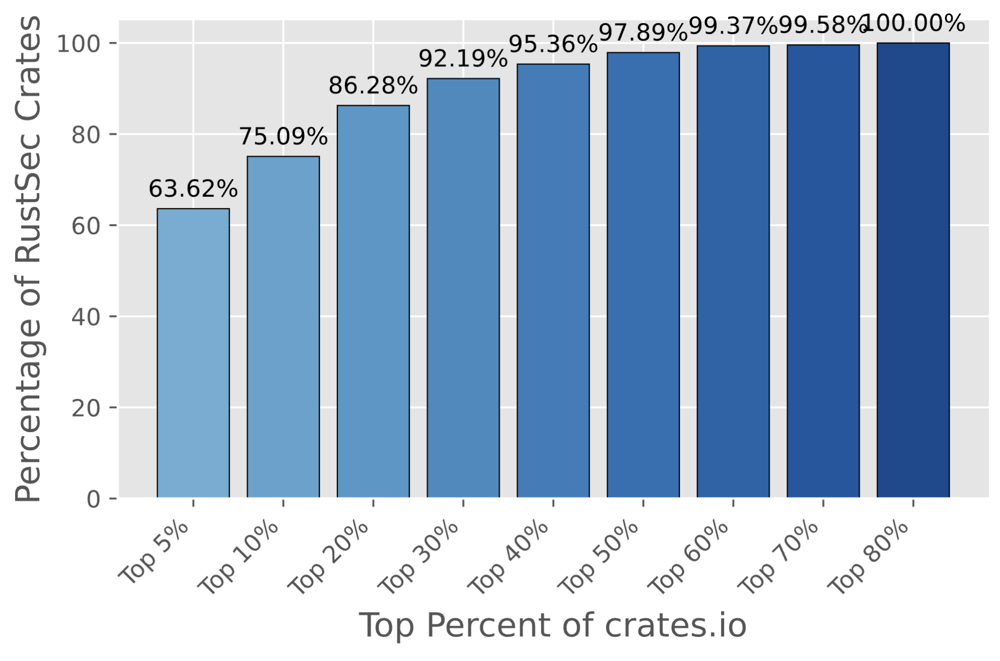
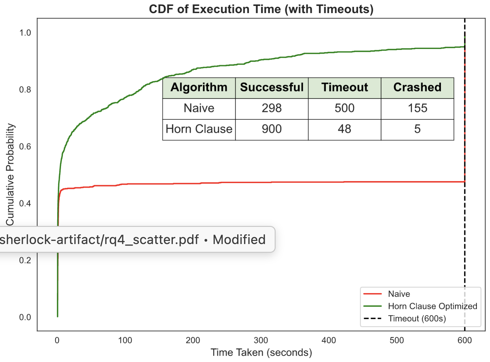
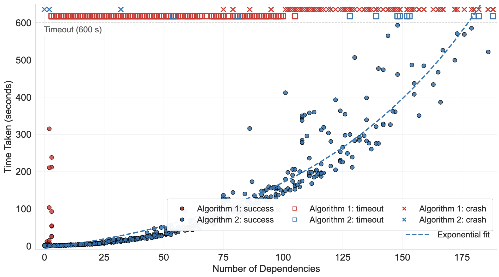

# Cargo-Sherlock Artifact 🕵️
`Cargo-Sherlock` (alternative name RHS for Rust Sherlock Holmes) is a Python-based tool designed to enhance the security of Rust projects by leveraging different metadata information about Rust crates. It is an automated reasoning tool that attempts to determine the safety of Rust crates by quantifying trust. 
This repository contains the artifact for paper[] submitted to FORMALISE 2026. 

## Installation

For the installation, please follow these steps below:

1. Clone this repository and the [cargo-scan](https://github.com/PLSysSec/cargo-scan) submodule.
```Bash
git clone --recurse-submodules https://github.com/muhammad-hassnain/cargo-sherlock-artifact
```
2. Install Rust via the [official website](https://www.rust-lang.org/tools/install). After installing Rust, you can verify the installation by running:
```Bash
rustc --version
```
This should display the installed Rust version.

3. Ensure you have Python 3 installed. You can verify your Python installation by running:
```Bash
python3 --version
```
This should display the installed Python version. If not installed, you can download it from the [official website](https://www.python.org/downloads/).

4. Run `make` to create a Python virtual environment, this will install all Python dependencies, activate the virtual environment, and build cargo-scan.
```Bash
make
```

This should take 3-5 minutes and will prompt you for your GitHub personal access token (see step 5 below).

5. You can Generate a GitHub personal access token from [token page](https://github.com/settings/tokens/new). Please select Generate new token (classic). Then, name your token, select an expiration date, and grant the token at least the `public_repo` scope by checking the box. Finally, create and copy your token and paste it. In case, you didn't provide a token at installation time, you can create the file `helpers/token.txt` and paste your token there later.

6. You can activate the python virtual environment by running: 
```bash
source .venv/bin/activate 
```
You should now see a `(.venv)` prefix in your terminal indicating that the virtual environment is active.

You can check your installation is successful by running:
```bash
python3 sherlock.py trust anyhow 1.0.97
```
You should see something like:
 


## Replication Instructions


We provide you with step-by-step instructions and scripts to replicate the results for each research question (RQ) presented in the paper.

### RQ1: Synthetic Typosquatted Attacks

This experiment involves running Cargo-Sherlock on top 100 frequently downloaded crates from crates.io and generating synthetic typosquatted versions of these crates, running Cargo-Sherlock on them, and analyzing the results. We provide you a list of top 100 crates from the time of our experiments in the file named `top100_crates.csv`. You can run the evaluation script for RQ1 with:

```Bash
python3 eval_rq1.py
```
This default command will use our cached results to generate the heatmap (Figure 5a) stored in `severity_heatmap.pdf`. This is the plot we get:



We also provide an option to run the experiment in different modes based on your time and resource availability:


1. Full Experiment (Expected to take around _ hours):
```Bash
python3 eval_rq1.py -m full
```
This version will run Cargo-Sherlock on top 100 crates, create their typosquatted versions, run Cargo-Sherlock on these typosquatted crates, and analyze the results to produce the heatmap.

2. Partial Experiment using Existing Crates (Expected to take around _ minutes):
```Bash
python3 eval_rq1.py -m partial 
```
This version will skip the recreating of synthetic typosquatted crates and will use the already provided files in `local_crates/typo_crates` directory. It will run Cargo-Sherlock on these crates and analyze the results to produce the heatmap.

3. Most Efficient Experiment using Pre-computed Results (Expected to take around _ minutes):
```Bash
python3 eval_rq1.py -m cache
```
This version will skip both the recreating of synthetic typosquatted crates and running Cargo-Sherlock on them. It will use the already computed csv files generated by parsing the ouputs of Cargo-Sherlock stored in `evaluation/rq1/` directory. It will directly analyze these results to produce the heatmap.

### RQ2: Real-World Supply Chain Risks
We will replicate the experiment and the regenerate the figure 5(b) presented in the paper. The source code for faster_log crate is not publicly available on crates.io, therefore, we have included the source code for it in the `local_crates` directory. For faster_log, we will use the local path to analyze it, for other crates, we will fetch them from crates.io.

```Bash
python3 eval_rq2.py
```
This experiment is expected to take around _ minutes to run so we do not provide any caching or partial modes for this experiment. The table will be printed on the terminal and also saved to `rq2_results.txt`. This table corresponds to Figure 5(b) in the paper. The output should look something like this:




### RQ3: Analyzing RustSec Crates

In this experiment, we will analyze all the crates listed in the RustSec advisory database. You can run the evaluation script for RQ3 using:
```Bash
python3 eval_rq3.py
``` 
This will run the experiment in cached mode using the existing Cargo-Sherlock reports for RustSec crates, and recreate the Figure 6(a) and Figure 6(b) in the paper stored at `rustsec-distribution.pdf` and `rustsec-percentiles.pdf` respectively.

The output plots will be as follows:

RustSec Distribution Plot:


RustSec Percentiles Plot:


However, if you want to run the full experiment (expected to take 2-3 hours) without using cached results, you will have to follow these steps:

1. Open the file `solver.py` in a text editor.
2. Comment out the line 139-144 and 151-160. These lines are responsible for adding assumptions based on RustSec advisories. We do not want these assumptions to be included in our analysis for RQ3.
3. Save the file after making these changes.
Now, we can run the evaluation script for RQ3:
```Bash
python3 eval_rq3.py --mode full
```
This will run Cargo-Sherlock on all RustSec crates, generate new reports, and then recreate the plots. 

### RQ4: Evaluating Algorithm Performance

In this experiment, we will evaluate the performance of the two algorithms (Horn and Naive) implemented in Cargo-Sherlock for solving the mintrust problem. You can run the evaluation script for RQ4 using:

```Bash
python3 eval_rq4.py
```
This will run the experiment in cached mode using the existing time measurements for both algorithms on random 1000 crates, and recreate the CDF plot showing the time taken by both algorithms stored at `rq4_cdf.pdf` (Figure 7a) and the dependency count plot with exponential fit stored at `rq4_scatter.pdf`. (Figure 7b).

The expected output plots will be as follows:

RQ4 CDF Plot:


RQ4 Scatter Plot:


We also provide an option to run the full experiment. It is expected to take around 12-14 hours to run. If you want to run the full experiment without using cached results for time taken, you will have to follow these steps:

1. If you ran RQ3 in full mode previously, you will need to revert the changes made to `solver.py` to re-enable the assumptions based on RustSec advisories If not, you can skip to step 4.
2. Open the file `solver.py` in a text editor.
3. Uncomment the lines 139-144 and 151-160. Save the file after making these changes.
4. Now, we can run the evaluation script for RQ4:
```Bash
python3 eval_rq4.py -m full
```
This should run Cargo-Sherlock on 1000 random crates from crates.io using both algorithms, measure the time taken, and then recreate the plots. 