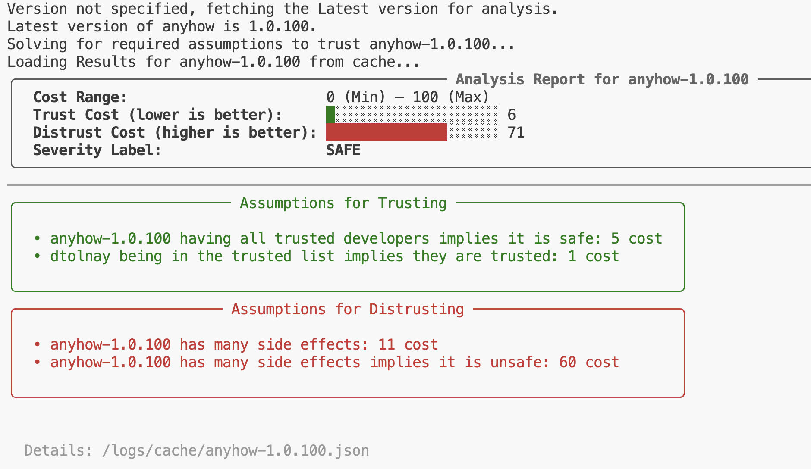
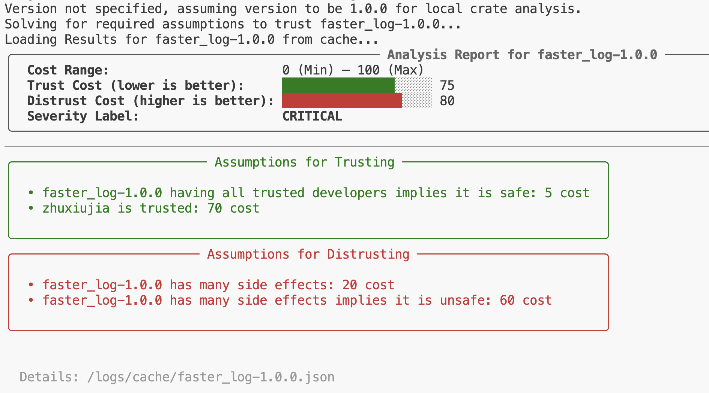

# Cargo-Sherlock Artifact 🕵️

This repository contains the artifact for `TODO` submitted to FORMALISE 2026.

`Cargo-Sherlock` is a Python-based tool designed to enhance the security of Rust projects by leveraging different metadata information about Rust crates. It is an automated reasoning tool that attempts to determine the safety of Rust crates by quantifying trust.

## Installation **(skip this step if you have the virtual machine)**

For the installation, please follow these steps below:

1. Clone this repository and the [cargo-scan](https://github.com/PLSysSec/cargo-scan) submodule.
```Bash
git clone --recurse-submodules https://github.com/muhammad-hassnain/cargo-sherlock-artifact
```
2. Install Rust via the [official website](https://www.rust-lang.org/tools/install). After installing Rust, you can verify the installation by running:
```Bash
rustc --version
```
This should display the installed Rust version.

3. Ensure you have Python 3 installed. You can verify your Python installation by running:
```Bash
python3 --version
```
This should display the installed Python version. If not installed, you can download it from the [official website](https://www.python.org/downloads/).

4. Run `make` to create a Python virtual environment, this will install all Python dependencies, activate the virtual environment, and build cargo-scan.
```Bash
make
```

This should take 3-5 minutes and will prompt you for your GitHub personal access token (see step 5 below).

5. You can Generate a GitHub personal access token from [token page](https://github.com/settings/tokens/new). Please select Generate new token (classic). Then, name your token, select an expiration date, and grant the token at least the `public_repo` scope by checking the box. Finally, create and copy your token and paste it. In case, you didn't provide a token at installation time, you can create the file `helpers/token.txt` and paste your token there later.

6. You can activate the python virtual environment by running:
```bash
source .venv/bin/activate
```
You should now see a `(.venv)` prefix in your terminal indicating that the virtual environment is active.

## Running the virtual machine

If you have the virtual machine, `<TODO>`

## Checking that everything works

Once you have done the installation (or opened the virtual machine),
you can check your installation is successful by running:
```bash
python3 sherlock.py trust anyhow 1.0.97
```
You should see something like:


## Replicating the experiments

We provide you with step-by-step instructions and scripts to replicate the results for each research question (RQ) presented in the paper.

### RQ1: Synthetic Typosquatted Attacks

This experiment involves running Cargo-Sherlock on top 100 frequently downloaded crates from crates.io and generating synthetic typosquatted versions of these crates, running Cargo-Sherlock on them, and analyzing the results. We provide you a list of top 100 crates from the time of our experiments in the file named `top100_crates.csv`. You can run the evaluation script for RQ1 with:

```Bash
python3 eval_rq1.py
```
This default command will use our cached results to generate the heatmap (Figure 5a) stored in `severity_heatmap.pdf`. This is the plot we get:


We also provide an option to run the experiment in different modes based on your time and resource availability:

1. Full Experiment 
```Bash
python3 eval_rq1.py -m full
```
This version will run Cargo-Sherlock on top 100 crates, delete existing typosquatted crates, create them again, run Cargo-Sherlock on these typosquatted crates, and analyze the results to produce the heatmap.

2. Partial Experiment using Existing Crates:
```Bash
python3 eval_rq1.py -m partial
```
This version will skip the recreating of synthetic typosquatted crates and will use the already provided files in `local_crates/typo_crates` directory. It will run Cargo-Sherlock on these crates and analyze the results to produce the heatmap.

3. Most Efficient Experiment using Pre-computed Results:
```Bash
python3 eval_rq1.py -m cache
```
This version will skip both the recreating of synthetic typosquatted crates and running Cargo-Sherlock on them. It will use the already computed csv files generated by parsing the ouputs of Cargo-Sherlock stored in `evaluation/rq1/` directory. It will directly analyze these results to produce the heatmap.

### RQ2: Real-World Supply Chain Risks

We will replicate the experiment and the regenerate the figure 5(b) presented in the paper. The source code for faster_log crate is not publicly available on crates.io, therefore, we have included the source code for it in the `local_crates` directory. For faster_log, we will use the local path to analyze it, for other crates, we will fetch them from crates.io.

```Bash
python3 eval_rq2.py
```
This experiment is expected to take around 10-15 minutes to run so we do not provide any caching or partial modes for this experiment. The table will be printed on the terminal and also saved to `rq2_results.txt`. This table corresponds to Figure 5(b) in the paper. The output should look something like this:


### RQ3: Analyzing RustSec Crates

In this experiment, we will analyze all the crates listed in the RustSec advisory database. You can run the evaluation script for RQ3 using:
```Bash
python3 eval_rq3.py
```
This will run the experiment in cached mode using the existing Cargo-Sherlock reports for RustSec crates, and recreate the Figure 6(a) and Figure 6(b) in the paper stored at `rustsec-distribution.pdf` and `rustsec-percentiles.pdf` respectively.

The output plots will be as follows:

RustSec Distribution Plot:


RustSec Percentiles Plot:


However, if you want to run the full experiment (expected to take 2-3 hours) without using cached results, you will have to follow these steps:

1. Open the file `solver.py` in a text editor.
2. Comment out the line 139-144 and 151-160. These lines are responsible for adding assumptions based on RustSec advisories. We do not want these assumptions to be included in our analysis for RQ3.
3. Save the file after making these changes.
Now, we can run the evaluation script for RQ3:
```Bash
python3 eval_rq3.py --mode full
```
This will run Cargo-Sherlock on all RustSec crates, generate new reports, and then recreate the plots.

### RQ4: Evaluating Algorithm Performance

In this experiment, we will evaluate the performance of the two algorithms (Horn and Naive) implemented in Cargo-Sherlock for solving the mintrust problem. You can run the evaluation script for RQ4 using:

```Bash
python3 eval_rq4.py
```
This will run the experiment in cached mode using the existing time measurements for both algorithms on random 1000 crates, and recreate the CDF plot showing the time taken by both algorithms stored at `rq4_cdf.pdf` (Figure 7a) and the dependency count plot with exponential fit stored at `rq4_scatter.pdf`. (Figure 7b).

The expected output plots will be as follows:

RQ4 CDF Plot:


RQ4 Scatter Plot:


We also provide an option to run the full experiment. It is expected to take around 12-14 hours to run. If you want to run the full experiment without using cached results for time taken, you will have to follow these steps:

1. If you ran RQ3 in full mode previously, you will need to revert the changes made to `solver.py` to re-enable the assumptions based on RustSec advisories If not, you can skip to step 4.
2. Open the file `solver.py` in a text editor.
3. Uncomment the lines 139-144 and 151-160. Save the file after making these changes.
4. Now, we can run the evaluation script for RQ4:
```Bash
python3 eval_rq4.py -m full
```

This should run Cargo-Sherlock on 1000 random crates from crates.io using both algorithms, measure the time taken, and then recreate the plots.

Note: Even in full mode, the cache files are used for metadata. This is because, the question aimed to evaluate the performance of the two algorithms - so the metadata collection time is not relevant to this research question. If you really want to re-collect metadata for all crates, you can delete the files in `logs/` directory before running the full experiment. But than you will have to run the experiment twice, the first run should build the cache files and than second run can be used to measure the time taken by both algorithms.

## Directory structure

The repository contains:

1. The main script is in `sherlock.py`. This serves as the entry point for the tool. It takes command-line arguments to specify the crate and the mode to analyze. It uses various other modules which are listed below:
   - `helpers/`: This directory contains the following helper modules:
     - `assumption.py`: This file defines the Assumption class used to represent trust assumptions.
     - `costs.py`: This file contains the smoothing functions used for parametric assumptions, Users can customize the costs for these assumptions here. It also contains the synthesizing function to combine the trust and distrust costs. 
     - `crate_data.py`: This file defines the CrateVersion class and is called by sherlock.py to start collecting metadata for the specified crate. It uses some other modules to fetch metadata and format it into a json format.
     - `logger.py` : This file is the core logic for collecting metdata about the crate, running static analsis tools and other related information.
     - `rustsectry.py`: This file implements the logic to check whether the given crate appears on RustSec advisory database or not.
     - `token.txt` : This file contains the GitHub personal access token, used to query GitHub API for fetching reposoitory related metadata.
   - `scrapper.py`: This file is used to scrape RustSec and store the output in `helpers/data.txt`, which is used by `rustsectry.py` to check if a crate is listed in RustSec database.
   - `solver.py`: This file contains the logic for encoding and solving the mintrust problem using Z3 SMT solver. It implements two algorithms: Horn and Naive. 

2. `cargo-scan/` : This is a submodule containing the cargo-scan tool, which is used by Cargo-Sherlock to collect side effects of given crate.

3. `audits/` : This directory contains the audit reports gathered from various organizations. 

4. `logs/` : This directory contains both the logs of anlaysis for debugging purposes and the cached reports for crates analyzed during experiments.

5. `processing/` : This directory is used by Cargo-Sherlock to store intermediate files during the analysis and is cleaned up after the analysis is complete.

6. `evaluation/` : This directory is used to store the results of trust mode analysis for different research questions (RQ1, RQ2, RQ3, RQ4). Each RQ has its own subdirectory. These are populated by:
    - `eval_rq1.py`: This script is used to replicate the experiments for RQ1 (Synthetic Typosquatted Attacks).
    - `eval_rq2.py`: This script is used to replicate the experiments for RQ2 (Real-world Typosquatted Attacks).
    - `eval_rq3.py`: This script is used to replicate the experiments for RQ3 (Tool Output on known vulnerable crates).
    - `eval_rq4.py`: This script is used to replicate the experiments for RQ4 (Algorithm 1 and 2 scalability with respect to number of dependencies).

7. `Makefile` : This file contains the commands to set up the Python virtual environment, install miri and build cargo-scan and do other tool setup related tasks. 

## Running the tool on your own examples

Cargo-Sherlock can be used to analyze any Rust crate available on crates.io or on a local path. It has two modes: logs mode and trust mode. The tool can be run as follows:

```Bash
python3 sherlock.py <mode> <crate-name> <crate-version> [-p <absolute-path-to-local-crate>] [-o <output-file>] [-u] [--no-horn]
```
The flags are defined as follows:
- `<crate-name>` is a required argument specifying the name of the crate to analyze.
- `<crate-version>` is the version of the crate to analyze (optional, if not specified, latest version will be used). For local crates, if version is not specified, it is assumed to be 1.0.0.
- `<mode>` can be either `logs` or `trust` (more on these modes below).
- `-p <absolute-path-to-local-crate>`: Optional - Specifies a local path to the crate instead of fetching it from crates.io.
- `-o <output-file>`: Optional - Specifies an output file to save the results. If not provided, results will be printed to the console and saved to logs directory.
- `-u`: Optional - If provided, tool updates the metadata cache for RustSec advisories before running the analysis.
- `--no-horn`: Optional - If provided, tool uses only the Algorithm 1 (Naive) from the paper to solve the mintrust problem - If not provided, tool uses Algorithm 2 (Horn) by default.

### Logs Mode

Logs mode can be used to collect metadata, audit and other related information about the crate. You can run this by:

```Bash
python3 sherlock.py logs <crate-name> <crate-version>
```
The version is optional, and if not specified, the latest version will be used. You can run it on anyhow crate as follows:
```Bash
python3 sherlock.py logs anyhow
```
You should see the output similar to this:

```
Version not specified, fetching the Latest version for analysis.
Latest version of anyhow is 1.0.100.
Getting logging information About crate anyhow-1.0.100...
Cache file not found, running cargo sherlock on anyhow-1.0.100...
Logging information for anyhow-1.0.100:
{'audits': [{'criteria': 'safe-to-deploy',
             'delta': '1.0.62 -> 1.0.66',
             'notes': 'This update looks to be related to minor fixes and '
                      'mostly integrating with a\\nnightly feature in the '
                      'standard library for backtrace integration. No '
                      'undue\\n`unsafe` is added and nothing unsurprising for '
                      'the `anyhow` crate is happening\\nhere.\\n',
             'organization': 'bytecode-alliance',
             'version': ''},
            {'criteria': 'safe-to-deploy',
             'delta': '1.0.69 -> 1.0.71',
             'notes': '',
             'organization': 'bytecode-alliance',
             'version': ''},
            ....
            {'criteria': 'safe-to-deploy',
             'delta': '1.0.95 -> 1.0.97',
             'notes': '',
             'organization': 'zcash',
             'version': ''}],
 'dependencies': [],
 'developers': ['dtolnay'],
 'downloads': `450366800`,
 'failed_rudra': False,
 'forks': 172,
 'in_rust_sec': False,
 'in_rustsec_current': False,
 'in_rustsec_patched': False,
 'miri': False,
 'miri_details': {'failed': 0,
                  'filtered_out': 0,
                  'ignored': 0,
                  'measured': 0,
                  'passed': 26,
                  'status': 'ok',
                  'time_seconds': 0.62},
 'num_side_effects': 78,
 'num_unsafe_calls': 53,
 'passed_audit': False,
 'past_audit': True,
 'rustsec_label': 'Safe',
 'rustsec_tag': None,
 'stars': 6249}
```

An example usage on a local crate is also shown below. You can run logs mode on a local path by providing the path instead of crate name:

```Bash
python3 sherlock.py logs <crate-name> <crate-version> --path <absolute-path-to-local-crate>
```

Here is an example run on the faster_log crate stored locally in this repository:

```Bash
python3 sherlock.py log faster_log -p /Users/hassnain/Desktop/final/cargo-sherlock-artifact/local_crates/faster_log
```
You should see the output similar to this:

```
Version not specified, assuming version to be 1.0.0 for local crate analysis.
Getting logging information About crate faster_log-1.0.0...
Cache file not found, running cargo sherlock on faster_log-1.0.0...
This crate has not been audited by any organization.
Logging information for faster_log-1.0.0:
{'audits': [],
 'dependencies': [],
 'developers': ['zhuxiujia'],
 'downloads': 171,
 'failed_rudra': False,
 'forks': 21,
 'in_rust_sec': False,
 'in_rustsec_current': False,
 'in_rustsec_patched': False,
 'miri': False,
 'miri_details': {'failed': 0,
                  'filtered_out': 0,
                  'ignored': 0,
                  'measured': 0,
                  'passed': 0,
                  'status': 'ok',
                  'time_seconds': 0.0},
 'num_side_effects': 11,
 'num_unsafe_calls': 0,
 'passed_audit': False,
 'past_audit': False,
 'rustsec_label': 'Safe',
 'rustsec_tag': None,
 'stars': 266}
```

### Trust Mode 

Trust mode builds on top of this logs mode and solves the mintrust problem for the given crate. You can run this by:

```Bash
python3 sherlock.py trust <crate-name> <crate-version>
```

For example, you can run it on anyhow crate as follows:
```Bash
python3 sherlock.py trust anyhow
```

You should see the output similar to this:


An example usage on a local crate is also shown below. You can run trust mode on a local path by providing the path instead of crate name:

```Bash
python3 sherlock.py trust <crate-name> <crate-version> --path <absolute-path-to-local-crate>
```

For example, you can run it on the faster_log crate stored locally in this repository as follows:

```Bash
python3 sherlock.py trust faster_log -p /Users/hassnain/Desktop/final/cargo-sherlock-artifact/local_crates/faster_log
```
You should see the output similar to this:



## Reusing and Extending Cargo-Sherlock

Cargo-Sherlock is open source and is easily reusable as shown in the previous section. It is also very customizable and extensible. Users can modify the trust costs, trusted author list and other parameters by editing the files listed in Directory structure section. Users can also extend the tool by adding new assumptions, more static or dynamic analysis tools, or by integrating it with other systems. Cargo-Sherlock features a MIT license which allows reuse and repurposing of the artifact. There is no specific system or VM requirement to run the tool beyond the installation steps mentioned above. We encourage other researchers to build upon our work and contribute to the open-source community.


