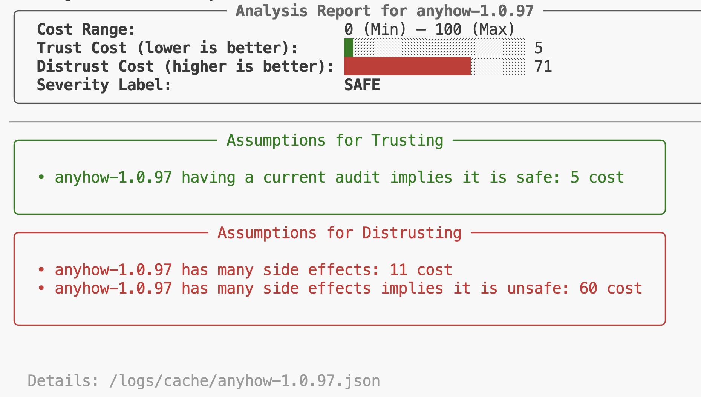

# Cargo-Sherlock Artifact 🕵️
`Cargo-Sherlock` (alternative name RHS for Rust Sherlock Holmes) is a Python-based tool designed to enhance the security of Rust projects by leveraging different metadata information about Rust crates. It is an automated reasoning tool that attempts to determine the safety of Rust crates by modeling trust. 
This repository contains the artifact for paper[] submitted to FORMALISE 2026. 

## Installation

For the installation, you can either follow the steps below or download our pre-configured Virtual Machine with all dependencies installed from [Cargo Sherlock VM](). If you downloaded the VM, you can skip step 1-5. 

1. Clone this repository and the [cargo-scan](https://github.com/PLSysSec/cargo-scan) submodule.
```Bash
git clone --recurse-submodules https://github.com/muhammad-hassnain/cargo-sherlock-artifact
```
2. Install Rust via the [official website](https://www.rust-lang.org/tools/install). After installing Rust, you can verify the installation by running:
```Bash
rustc --version
```
This should display the installed Rust version.

3. Ensure you have Python 3 installed. You can verify your Python installation by running:
```Bash
python3 --version
```
This should display the installed Python version. If not installed, you can download it from the [official website](https://www.python.org/downloads/).

4. Run `make` to create a Python virtual environment, this will install all Python dependencies, activate the virtual environment, and build cargo-scan.
```Bash
make
```

This should take 3-5 minutes and will prompt you for your GitHub personal access token (see step 5 below).

5. You can Generate a GitHub personal access token from [token page](https://github.com/settings/tokens/new). Please select Generate new token (classic). Then, name your token, select an expiration date, and grant the token at least the `public_repo` scope by checking the box. Finally, create and copy your token and paste it. In case, you didn't provide a token at installation time, you can create the file `helpers/token.txt` and paste your token there later.

6. You can activate the python virtual environment by running: 
```bash
source .venv/bin/activate 
```
You should now see a `(.venv)` prefix in your terminal indicating that the virtual environment is active.

You can check your installation is successful by running:
```bash
python3 sherlock.py trust anyhow 1.0.97
```
You should see something like:
 



## Replication Instructions


We provide you with step-by-step instructions and scripts to replicate the results for each research question (RQ) presented in the paper.

### RQ1: Synthetic Tuposquatted Attacks

Here first we will create 100 synthetic typosquatted crates using the script `generate_typosquatted_crates.py`. We also need to run cargo-sherlock on 100 popular crates. 

### RQ2: Real-World Supply Chain Risks
We will replicate the experiment and the regenerate the table [Table 4] presented in the paper. The source code for faster_log crate is not publicly available on crates.io, therefore, we have included the source code for it in the `local_crates` directory. For faster_log, we will use the local path to analyze it, for other crates, we will fetch them from crates.io.

```Bash
python3 eval_rq2.py
```
This script will run Cargo-Sherlock on serde_yaml-0.9 vs serde_yml

### RQ3:

For this we need to disable the assumptions made in Cargo-Sherlock about RustSec advisories. For this , please follow the steps below:
1. Open the file `solver.py` in a text editor.
2. Comment out the line 139-144 and 151-160. The lines are: (some more lines as well)
```Python
    if metadata["rustsec_tag"] is not None:
        uncategorized = z3.BoolVal(rustsec_label == "Uncategorized") # crate has an uncategorized label
        vulnerability_tag = z3.BoolVal("Vulnerability" in metadata["rustsec_tag"]) # crate has a vulnerability tag
        info_unmaintained_tag = z3.BoolVal("INFOUnmaintained" in metadata["rustsec_tag"]) # crate has an info unmaintained tag
        info_unsound_tag = z3.BoolVal("INFOUnsound" in metadata["rustsec_tag"]) # crate has an info unsound tag
        info_notice_tag = z3.BoolVal("INFONotice" in metadata["rustsec_tag"]) # crate has an info notice tag
        assumptions.append(Assumption(f"{crate} being uncategorized and having a vulnerability tag in RustSec implies it is unsafe", z3.Implies(z3.And(uncategorized, vulnerability_tag), unsafe), 10))
        assumptions.append(Assumption(f"{crate} being uncategorized and having a unsound tag in RustSec implies it is unsafe", z3.Implies(z3.And(uncategorized, info_unsound_tag), unsafe), 20))
        assumptions.append(Assumption(f"{crate} being uncategorized and having a notice tag in RustSec implies it is unsafe", z3.Implies(z3.And(uncategorized, info_notice_tag), unsafe), 60))
        assumptions.append(Assumption(f"{crate} being uncategorized and having a unmaintained tag in RustSec implies it is unsafe", z3.Implies(z3.And(uncategorized, info_unmaintained_tag), unsafe), 50))
```
These are the assumptions that Cargo-Sherlock makes about RustSec advisories. By commenting them out, we deny Cargo-Sherlock about any information of these crates being in the RustSec database.

### RQ4:


